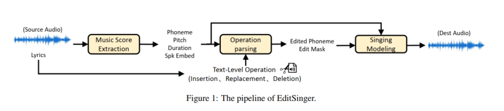
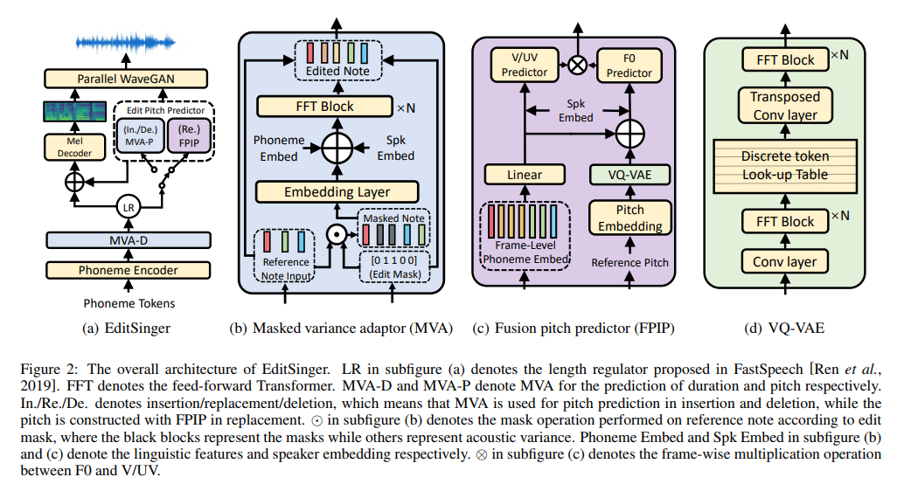

# <center>论文名/模型名</center>

## 摘要/功能介绍

 absxacsa



<!--  -->

<script type="text/javascript">
        function myFunction() {
            // 这里写入要执行的代码逻辑
            // alert("Hello World!");
            var table = document.getElementById("mytab");
            var td1=table.getElementsByTagName("tr").item(1).getElementsByTagName("td").item(1)
            td1.innerHTML = '```python\n print('hello world')'
        }

        function progress() {
            var bar = document.querySelector('.progress');
            var width = 0;
            var id = setInterval(frame, 10);
            function frame() {
                if (width >= 100) {
                    clearInterval(id);
                } else {
                    width++;
                    bar.style.width = width + '%';
                }
            }
            myFunction()
        }
        
  
</script>


**模型演示:**<br> 
<form  method="get">
  <p>输入: <input type="text" name="fname" style="width: 550px;" /> <button type="button" onclick='progress()'>运行</button></p>
  <!-- <input type="submit" value="Submit" /> -->
</form>


<div class="progress-bar">
  <div class="progress"></div>
</div>

<div>
    <table style='width: 100%;' id='mytab'>
        <thead>
        <tr>
            <th>模型输出-1</th>
            <th>模型输出-2</th>
            <th>实际答案</th>
            <!-- <th>EditSinger(insertion)</th>
            <th>EditSinger(replacement)</th>
            <th>EditSinger(deletion)</th> -->
        </tr>
        </thead>
        <tbody>
        <tr>
            <td width="400px" height="400px"></td>
            <td width="400px" height="400px"></td>
            <td width="400px" height="400px"></td>
            <!-- <td><audio style="width: 150px;" controls="" ><source src="resources/MOS1/editsinger(insertion)/0000000001.wav" type="audio/wav"></audio></td>
            <td><audio style="width: 150px;" controls="" ><source src="resources/MOS1/editsinger(replacement)/0000000001.wav" type="audio/wav"></audio></td>
            <td><audio style="width: 150px;" controls="" ><source src="resources/MOS1/editsinger(deletion)/0000000001.wav" type="audio/wav"></audio></td> -->
        </tr>
    </tbody>
    </table>
</div>

